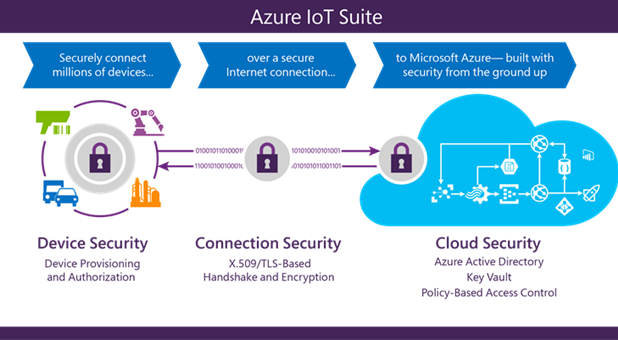

<properties
 pageTitle="从头开始保障你的物联网的安全 | Azure"
 description="本文介绍了 Azure IoT 套件的内置安全功能"
 services=""
 suite="iot-suite"
 documentationCenter=""
 authors="YuriDio"
 manager="timlt"
 editor=""/>

<tags
 ms.service="iot-suite"
 ms.devlang="na"
 ms.topic="article"
 ms.tgt_pltfrm="na"
 ms.workload="na"
 ms.date="01/31/2017"
 ms.author="yurid"
 wacn.date="03/31/2017"/>  

# 物联网安全基础知识
物联网 (IoT) 使全球企业面临独特的安全、隐私权与合规性挑战。不同于传统网络技术（这些问题是以软件及其实现方式为中心），IoT 在意的是当网络与物理世界融合时将发生什么情况。保护 IoT 解决方案要求确保安全预配设备，保护这些设备与云之间的连接，以及在处理和存储期间保护云中数据的安全。但是，针对此类功能运行的是资源受限的设备、根据地理位置分布的部署，以及解决方案中的大量设备。

本文探讨 Azure IoT 套件如何提供安全且专用的物联网云解决方案。Azure IoT 套件提供完整的端对端解决方案，彻底为每个阶段内置安全性。在 Azure，开发安全的软件是软件工程实务的一部分，这立足于我们数十年来长时间开发安全软件的经验。为了确保这一点，安全开发周期 (SDL) 是基础的开发方法，再加上基础结构级别安全服务的主机，例如运行安全保证 (OSA)，以及 Microsoft 反数字犯罪部门、Microsoft 安全响应中心和 Microsoft 恶意软件防护中心。

Azure IoT 套件提供独特的功能，从 IoT 设备预配、连接到及存储数据是简单且明确的，而最棒的是安全。在本文中，我们将了解 Azure IoT 套件的安全功能和部署策略，以确保能够迎接安全、隐私权与合规性挑战。

## 介绍
物联网 (IoT) 是将来的主流，可为企业提供实时且真实世界的商机，以降低成本、提高营收，并使其业务转型。但是，许多企业因为顾虑到安全、隐私与合规性，对组织中部署 IoT 而有所迟疑。主要的忧虑来自 IoT 基础结构的独特性，它将网络与物理世界合并在一起，将这两个世界中固有的各个风险混合。IoT 的安全是关于确保在设备上运行的代码完整性、为设备和用户提供身份验证、定义设备（以及此类设备所生成的数据）的明确所有权，以及针对网络与物理攻击进行复原。

其次，还有隐私问题。公司希望数据收集过程透明化，例如，要收集哪些数据及原因、可查看数据的人员、可控制访问的人员等。最后，还有关于设备及操作人员的一般安全问题，以及保持行业标准合规性的问题。

假如存在安全、隐私权、透明性与合规性忧虑，选择正确的 IoT 解决方案提供商仍是一项挑战。将由各种不同厂商所提供的 IoT 软件和服务的各个部分联接在一起，将在很难检测到的安全、隐私权、透明性与合规性中生成隔阂，让我们单独进行修正。选择正确的 IoT 软件和服务提供商的根据是，查找具有跨越多个纵向市场和地理位置运行的丰富经验，但也能以安全且透明的方式进行缩放的提供商。同样地，它对于有数十年在全球无数台计算机上运行安全软件的体验的卓越提供商非常实用，并且能够鉴别由此物联网的新世界所导致的威胁面。

## 安全基础结构基础知识
[Azure 云](https://www.microsoft.com/enterprise/microsoftcloud/default.aspx#fbid=WzBsRQi6aGk)基础结构支持 127 个国家/地区十亿个以上的客户。使用我们数十年之久构建企业软件的体验，并在世界各地运行一些大型在线服务，相较于多数客户可自行实现，我们提供更高级别的增强安全、隐私权、合规性及威胁缓解实践。

我们的[安全开发生命周期 (SDL)](https://www.microsoft.com/sdl/) 提供必要的全企业开发过程，将安全要求嵌入整个软件生命周期中。为了帮助确保运行活动遵循一致的安全优先级，我们使用运行安全保证 (OSA) 流程中规定的严苛安全指导方针。我们还与第三方审核机构合作以持续验证我们符合法规遵循义务，并通过创建卓越的中心（包括 Microsoft 反数字犯罪部门、Microsoft 安全响应中心和 Microsoft 恶意软件防护中心），致力于产生广泛的安全成果。

## Azure - 适用于你的企业的安全 IoT 基础结构
 Azure 提供完整的云解决方案，其中结合了持续成长的集成式云服务（分析、机器学习服务、存储、安全、网络功能和 Web）集合，通过行业领先的承诺来为数据提供保护与隐私。我们的[假设性违规](https://azure.microsoft.com/blog/red-teaming-using-cutting-edge-threat-simulation-to-harden-the-microsoft-enterprise-cloud/)策略将通过由软件安全专家组成的专属“红队”，来模拟攻击、测试要检测的 Azure 能力、防范新兴威胁，以及从违规中恢复。我们的[全球事件响应](https://www.microsoft.com/TrustCenter/Security/DesignOpSecurity)团队夜以继日地工作，以减缓攻击与恶意活动造成的影响。该团队遵循事件管理、通信和恢复所创建的过程，并与内部和外部伙伴合作来使用可探索且可预测的接口。

我们的系统提供持续的入侵检测和防护、服务攻击预防、定期渗透测试和法医式工具帮助识别与缓解威胁。[多重身份验证](/documentation/articles/multi-factor-authentication/)可为访问网络的最终用户提供额外的安全层。此外，对于应用程序和主机提供程序，我们提供访问控制、监视、反恶意软件、漏洞扫描、修补和配置管理。

 Azure IoT 套件使用内置于 Azure 平台的安全和隐私功能，以及我们针对所有 Microsoft 软件进行的安全开发和操作所提供的 SDL 和 OSA 过程。这些过程提供基础结构保护、网络保护，以及标识与管理功能，作为任何解决方案安全的基础。

[IoT 套件](/documentation/articles/iot-suite-what-is-azure-iot/)内的 [Azure IoT 中心](/documentation/articles/iot-hub-what-is-iot-hub/)提供完全托管的服务，使用每一设备的安全凭据和访问控制，在 IoT 设备与 Azure 服务之间启用可靠且安全的双向通信，例如 [Azure 流分析](/documentation/articles/stream-analytics-introduction/)。

为了以最佳方式传达内置于 Azure IoT 套件的安全和隐私功能，我们已将套件细分为三个主要安全领域。

  

### 安全的设备预配和身份验证
当设备不在现场时，Azure IoT 套件将保护它们，方法是为每个设备提供唯一的标识密钥，在设备运行时，IoT 基础结构可用于与其进行通信。该过程非常快速且可轻松设置。使用用户选择的设备 ID 生成的密钥将形成令牌的基础，可以在设备和 Azure IoT 中心之间的所有通信中使用。

设备 ID 可以在制造期间（例如硬件信任模块中的闪存）与设备关联，或者可以使用现有的固定标识作为代理（例如 CPU 序列号）。由于更改设备中的此识别信息并不简单，因此请务必引入逻辑设备 ID，以防万一基础设备硬件更改，逻辑设备可保持不变。在某些情况下，设备标识的关联会发生在设备部署期间（也就是已经过验证的现场工程师实际上将在与解决方案后端通信的同时配置新设备）。[Azure IoT 中心标识注册表](/documentation/articles/iot-hub-devguide/)针对解决方案为设备标识和安全密钥提供安全存储。可将单个或一组设备标识添加到允许列表或方块列表，以便完全控制设备访问。

云中的 Azure IoT 中心访问控制策略，能够启用和禁用任何设备标识，必要时可提供方法来取消关联 IoT 部署中的设备。设备的这种关联和取消关联基于每个设备标识。

其他设备安全功能包括：

* 设备不会接受未经请求的网络连接。它们以仅限出站的方式建立所有连接和路由。若要让设备从后端接收命令，设备必须启动连接，以检查是否有任何挂起的命令要处理。在设备和 IoT 中心之间安全建立连接之后，在云和设备之间来回传递消息可以透明方式发送。
* 设备只能同与它们对等的已知服务（例如 Azure IoT 中心）进行连接或建立路由。
* 系统级授权和身份验证使用每个设备的标识，使访问凭据和权限可以近乎实时吊销。

### 安全的连接
消息传递的持久性是所有 IoT 解决方案的重要功能。永久传递命令和/或从设备接收数据的要求，可通过以下事实强调说明：IoT 设备是通过 Internet 或不可靠的其他类似网络来连接。Azure IoT 中心通过通知系统来提供云与设备之间消息传递的持久性，以响应消息。消息传递的额外持久性可通过在 IoT 中心缓存消息来实现，针对遥测最多七天，针对命令最多两天。

为确保可在资源受限的环境中节省资源和操作，效率非常重要。IoT 中心支持 HTTPS（安全 HTTP，流行 http 协议的行业标准安全版本），能够进行有效的通信。Azure IoT 中心支持的高级消息队列协议 (AMQP) 和消息队列遥测传输 (MQTT)，不只是根据资源使用的效率而设计，同时也可进行可靠的消息传递。

可缩放性需要能够与各式各样设备安全互操作的能力。Azure IoT 中心能够安全连接到已启用 IP 和未启用 IP 的设备。已启用 IP 的设备能够直接连接，并通过安全连接与 IoT 中心通信。未启用 IP 的设备是资源受限的，只能通过短距离协议（例如 Zwave、ZigBee 和蓝牙）来连接。现场网关可用于聚合这些设备并执行协议转换，以便与云进行安全的双向通信。

其他连接安全功能包括：

* 设备和 Azure IoT 中心之间，或网关和 Azure IoT 中心之间的通信路径，将配合使用 X.509 协议身份验证的 Azure IoT 中心使用行业标准的传输层安全 (TLS) 来保护。
* 为了保护设备以防止来路不明的入站连接，Azure IoT 中心不会打开任何设备的连接。设备将发起所有连接。
* Azure IoT 中心永久存储设备的消息，并等待连接设备。这些命令将存储两天，使设备能够基于电源或连接因素偶而进行连接来接收这些命令。Azure IoT 中心维护每个设备的设备队列。

### 安全处理和云中存储
通过加密通信以处理云中的数据，Azure IoT 套件有助于确保数据安全。这将提供弹性来实现额外加密并管理安全密钥。使用 Azure Active Directory (AAD) 进行用户身份验证和授权，Azure IoT 套件可以针对在云中的数据提供以策略为基础的授权模型，启用可审核和审查的轻松访问管理。此模型还能够以接近实时的方式吊销对云中数据以及连接到 Azure IoT 套件的设备的访问权限。

将数据移到云中之后，可以在任何用户定义工作流中处理和存储数据。访问数据的每个部分根据所用的存储服务通过 Azure Active Directory 来控制。

IoT 基础结构使用的所有密钥存储在云的安全存储中，并具有滚动更新能力，以防密钥需要重新预配。数据可以存储在 [DocumentDB](/documentation/articles/documentdb-introduction/) 或 [SQL 数据库](/documentation/articles/sql-database-faq/)中，启用所需安全级别的定义。此外，Azure 提供一种方式用于监视和审核对数据的所有访问权限，以提醒有任何入侵或未经授权的访问。

## 结束语
物联网是从事物开始 - 对业务最重要的事物。IoT 可以通过降低成本、提高营收和使业务转型，为企业提供令人赞叹的价值。这种转型的成败主要取决于是否选择了正确的 IoT 软件和服务提供商。这意味着要找到适当的提供商，其不仅可通过了解企业需要与要求来催化这种转型，也将提供使用安全、隐私、透明性与合规性构建的服务和软件作为主要设计考虑因素。Microsoft 具有开发和部署安全软件与服务的丰富经验，并持续在这个新的物联网时代中保持领先地位。

Microsoft Azure IoT 套件根据设计内建安全措施，启用安全的资产监视来改善效率、衍生运营性能来赋予创新，并采用高级的数据分析来使业务转型。使用有关安全的分层方式、多个安全功能和设计模式，Azure IoT 套件可帮助部署可信任来使任何业务转型的基础结构。

## 其他信息
每个 Azure IoT 套件的预配置解决方案将创建 Azure 服务的实例，例如：

* [**Azure IoT 中心**](/documentation/services/iot-hub/)：将云连接到“事物”的网关。可以缩放为每个中心有百万个连接，并使用每设备身份验证支持来处理大量数据，以帮助保护解决方案。
* [**Azure DocumentDB**](/documentation/services/documentdb/)：适用于半结构化数据的可缩放且已完全编制索引的数据库服务，可管理预配的设备的元数据，例如，属性、配置和安全属性。DocumentDB 提供高性能和高吞吐量处理、架构不可知的数据索引，以及丰富的 SQL 查询接口。
* [**Azure 流分析**](/documentation/services/stream-analytics/)：云中处理的实时流可让你快速开发和部署低成本分析解决方案，以便从设备、传感器、基础结构和应用程序实时获取深入了解。来自这种完全托管服务的数据可缩放为任何数量，同时保持高吞吐量、低延迟和复原能力。
* [**Azure App Services**](/documentation/services/app-service/)：一个云平台，用以构建能够连接到任何地方（在云中或本地）的数据的强大 Web 和移动应用。构建具有吸引力的 iOS、Android 和 Windows 移动应用。与软件即服务 (SaaS) 和企业应用程序相集成，这些应用程序一经使用便可直接连接到数十种基于云的服务和企业应用程序。使用最喜欢的语言和 IDE（.NET、Node.js、PHP、Python 或 Java）编写代码，以比以往更快的速度构建 Web 应用和 API。
* [**Azure Blob 存储**](/documentation/services/storage/)：可靠且符合经济效益的云存储，适用于设备发送到云的数据。

## 后续步骤

若要详细了解如何保护 IoT 解决方案，请参阅：

- [IoT 安全最佳实践][lnk-security-best-practices]
- [IoT 安全体系结构][lnk-security-architecture]
- [保护你的 IoT 部署][lnk-security-deployment]

[lnk-security-best-practices]: /documentation/articles/iot-security-best-practices/
[lnk-security-architecture]: /documentation/articles/iot-security-architecture/
[lnk-security-deployment]: /documentation/articles/iot-suite-security-deployment/

你还可以浏览 IoT 套件预配置的解决方案的一些其他特性和功能：

- [预见性维护预配置解决方案概述][lnk-predictive-overview]
- [有关 IoT 套件的常见问题][lnk-faq]

可以在 IoT 中心开发人员指南的[控制 IoT 中心的访问权限][lnk-devguide-security]中阅读 IoT 中心安全性的相关信息。
[lnk-predictive-overview]: /documentation/articles/iot-suite-predictive-overview/
[lnk-faq]: /documentation/articles/iot-suite-faq/
[lnk-devguide-security]: /documentation/articles/iot-hub-devguide-security/

<!---HONumber=Mooncake_0327_2017-->
<!--Update_Description:update meta properties-->